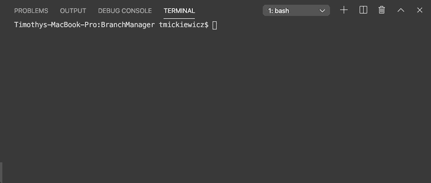

# BranchManager

## Demonstration

 
## Table of Contents
* [Description](#description)
* [Installation](#installation)
* [Licensing](#licensing)
* [Contributors](#contributors)
* [Contributing](#contributing)
* [Tests](#tests)
* [Github](#github) 

## Description
A Node CLI application to generate easily accessible team information for your company. You are able to create a team consisting of a manager/managers, engineers, and interns with information such as: email addresses, employee IDs, names, github accounts, schools, and office numbers.
 
## Installation
1. Go to [https://github.com/timothymickiewicz/BranchManager] and clone this repository.
2. Open terminal and paste the clone URL into the location where you want this repository to be created.
3. Open BranchManager in your code editor.
4. Ensure that your terminal is on the BranchManager directory and run `node app.js` in your terminal.
5. Answer the questions about your employees, and your team.html file will generate in the output folder.
 
## Licensing

 
## Contributors
Timothy Mickiewicz
* (shields.io) 
* (contributor-covenant.org)
 
## Contributing
 
Please note that this project is released with a Contributor Code of Conduct. By participating in this project you agree to abide by its terms. 
https://www.contributor-covenant.org/version/2/0/code_of_conduct/
 
## Tests
To run tests enter `npm run test` in the terminal.
 
## Contact
 
timothy.mickiewicz@gmail.com